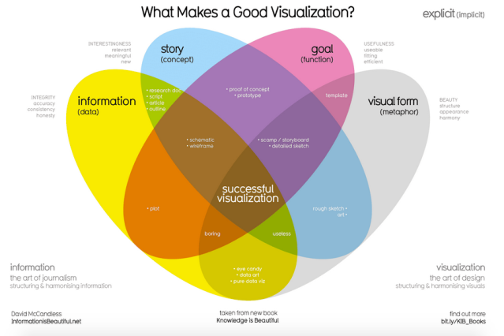

# Visual Storytelling: Visualizing Data and Data-Driven Narratives

After a lightening introduction to the history, philosophy and theory behind computer science, we move on to the output of data in a visualization. In a future week, you'll work with a no-code visualization tool called Tableau. This week, we start with the basics: the beauty of information visualized well as well as the pitfalls of poor visualizations. Also at stake are questions of what is left out--not because the visualization is bad, but because the data itself is limited or biased.

Good visualizations can be incredibly persuasive, but so can visualizations that fudge the data to persuade you, or that camouflage missing or biased data. In addition to learning good design properties of data visualization, we'll take a crash course in how to spot bad data visualizations that can deceive. We'll also consider what may be "invisible" due to the way data is collected or organized, with a case study of data on women.

We end the week with a consideration of how we now get much of our data news. Today, it's commonplace to find visualizations embedded in news stories, and data journalism appears almost indistinguishable from journalism. Is the rise of data journalism as well as so many niche news providers a sign of a healthy democracy? Or is the crisis of journalism, and in particular the waning of traditional news outlets and local news, a sign that we're heading into a world in which most people consume inaccurate news from their social media feed? As just one further point to consider for Friday's conversation, Noam Chomsky often claimed that even mainstream news was a propaganda machine, as is the educational system. You'll watch an interview from 1996 in which he details this viewpoint. What, if any thing, has changed since that interview, and for better or worse?

DataCamp this week is a 2 hour no-code course, Data Visualization for Everyone, which will reinforce the principals of data visualization. We will spiral back to information presented in this week's DataCamp, so you don't have to absorb it all in the first go. The "Test Your Understanding" sections will identify key concepts. In class, we'll continue to explore datasets introduced last week in class, this week with an eye to finding a story in the data through visualizations. On Friday we finally begin our Introduction to Python course with unit 1, Python Basics. We also do a quick intro to DataCamp projects that should seem easy, since you've already been introduced to Jupyter notebooks!

## **Monday: Visualizations Fundamentals**

- [The Beauty of Data Visualizations,](https://www.youtube.com/watch?v=5Zg-C8AAIGg) (18:00) David McCandless, TEDGlobal, 2010
- [Moving Beyond Data Visualization](https://www.youtube.com/watch?v=WkhJqhKtdf8) (12:50)
- [How to Spot Visualization Lies](https://flowingdata.com/2017/02/09/how-to-spot-visualization-lies/), Nathan Yau, FlowingData.com, Feb 2017
- [Interview with Criado Perez, author of Invisible Women: Data Bias in a World Designed for Men](https://www.wired.com/story/caroline-criado-perez-invisible-women/) Wired, July 2019
- Read the blurb about current forthcoming research: [Queer Data](https://www.bloomsbury.com/us/queer-data-9781350230729/)
- [The Age of Insight: Telling Stories with Data](https://www.youtube.com/watch?v=TA_tNh0LMEs) (4:16) Google News Initiative 2015
- DataCamp, [Understanding Data Visualization](https://app.datacamp.com/learn/courses/understanding-data-visualization)
    * Chapter 1: Visualizing Distributions
    * Chapter 2: Visualizing Two Variables
- Test Your Understanding
    * David McCandless stresses the importance of context for interpreting data. Why? What is an example?
    * What are some common ways that visualizations can lie?
    * How might interactive dashboards help us identify questions we didn't even know to ask?
    * Even as we critique the increasing role of Dataism in our lives, many groups are arguing for better representation in data. Why?
    * Continuous versus Categorical Variables
    * When might you use a Logarithmic-scaled plot?
    * Correlation: negative, positive, weak, strong

## **Wednesday: Telling Stories with Data**

- [Telling Stories with Data](https://www.youtube.com/watch?v=r5_34YnCmMY) (4:46) Scott Berinato, Harvard Business Review, Oct 2019
- [How to Become a Data Visualization Superstar](https://www.youtube.com/watch?v=ZRskHRowFCM) (11:01) Storytelling with Data, Feb 2021
- [John Snow's Data Journalism: The Cholera Map That Changed the World](https://www.theguardian.com/news/datablog/2013/mar/15/john-snow-cholera-map), Simon Rodgers, The Guardian, Mar 2013
- [The Five Types of Nicholas Cage Movies](https://fivethirtyeight.com/features/the-five-types-of-nicolas-cage-movies/), Walt Hickey, FiveThirtyEight.com, Apr 2018
- [Ali Wong: The Structure of Comedy](https://pudding.cool/2018/02/stand-up/), Russell Goldenberg and Matt Daniels, The Pudding
- DataCamp, [Understanding Data Visualization](https://app.datacamp.com/learn/courses/understanding-data-visualization)
    * Chapter 3: The Color and the Shape
    * Chapter 4: 99 Problems but a Plot Ain't One of Them
- Test Your Understanding
    * The first two videos demonstrate best practices for moving from visualizations to storytelling with data. For inspiration, you will read three examples of good storytelling with data: John Snow, perhaps the first data journalist, types of Nicholas Cage movies, and the structure of Ali Wong's comedy. There are some pretty granular explanations about the use of color in today's DataCamp assignment, and we take a deeper dive into what kind of graph to choose. Don't get mired in the details for now; focus on developing an intuitive sense of good practices and learning how to interpret different types of visualizations.

## **Friday: Data Journalism and Media**

- [Noam Chomsky on Propaganda](https://www.youtube.com/watch?v=GjENnyQupow) (30:00) The Big Idea, BBC, Feb 1996
- As you read the Snowden interview below, look up people and events you're not familiar with. We will discuss Snowden's revelations about government surveillance in a future week. This week, focus on his arguments about what is/is not covered by journalists and why. Follow links to the James Rosen case, the AP case, and the Drone reporting (we will discuss drones in a future week; here consider whether journalism has a right/duty to report on this type of information, and consider how few outlets convey this type of news).
- [Snowden Interview: Why the Media Isn't Doing It's Job](https://www.cjr.org/q_and_a/snowden.php), Emily Bell, Columbia Journalism Review, May 2016
- [Private Israel Spyware Used to Hack Cellphones of Journalists, Activists](https://www.washingtonpost.com/investigations/interactive/2021/nso-spyware-pegasus-cellphones/) Washington Post, July 18, 2o21.
- DataCamp, [Introduction to Python]()
    * Chapter 1: Python Basics
- DataCamp, [Introduction to DataCamp Projects]()
    * Test Your Understanding
- Consider all the factors that influence our access to good information. We start with the question of how well journalism actually informs us of important information (Chomsky), and Snowden's more recent argument that the media isn't doing it's job. Why not? How has the internet changed that situation? Should the government have the right to censor/monitor journalists? Is there any news that should be off-limits?

## **In Class Demos**

- [Human Trafficking Dataset Creation and Analysis repo](https://github.com/starry91/human-trafficking) with edited [Jupyter notebook](https://colab.research.google.com/drive/1bnM7wHQd7tEBUEOIDr7ppx3qHbe37Cbh?usp=sharing)
- Historical Data Visualizations
    * a. 1765  [Famous Persons Lifespans by Joseph Priestly](https://www.openculture.com/2016/07/joseph-priestley-visualizes-history-with-two-of-the-most-influential-infographics-ever-1769.html)  (Timeline)
    * b. 1769 [A New Chart of History by Joseph Priestly](https://en.wikipedia.org/wiki/A_New_Chart_of_History#/media/File:A_New_Chart_of_History_color.jpg) (Timeline)
    * c. 1792  [Proportional Cities Areas by Louis Fourcroy](https://www.historyofinformation.com/detail.php?id=3405)  (Heatmap)
    * d. 1800  [Manufacturing Wages vs Grain Prices by William Playfair](https://rss.onlinelibrary.wiley.com/doi/pdf/10.1111/j.1740-9713.2009.00342.x)  (Barchart)
    * e. 1869  [Napoleon's Russian Campaign by Charles Minard](https://upload.wikimedia.org/wikipedia/commons/2/29/Minard.png) (Stacked: Timeline/Line)
    * f. 1854  [Crimean War Mortality by Florence Nightingale](https://upload.wikimedia.org/wikipedia/commons/1/17/Nightingale-mortality.jpg)  (Radial Map)
- Data Journalist
    * a. [Reuters Graphics](https://graphics.reuters.com/)
    * b. [The Upshot - The New York Times](https://www.nytimes.com/section/upshot)
    * c. [The Pudding](https://pudding.cool/)
    * d. [FiveThirtyEight Data Visualizations](https://fivethirtyeight.com/tag/data-visualization/)
    * e. [FLOWINGDATA](https://flowingdata.com/)
    * f. [Kantar Information is Beautiful Awards](https://www.informationisbeautifulawards.com/)
- [Harvard Business School Case Study: Gender Equality](https://www.nytimes.com/interactive/2014/02/27/education/harvard-tenure-pipeline.html), NYTimes, Sep 2013
- [Gender Equality in Multiple Visualizations](https://www.unwomen.org/en/digital-library/multimedia/2020/2/infographic-visualizing-the-data-womens-representation), UN, Feb 2020
- Computational Information Design, Benjamin Jotham Fry, MIT PhD Thesis, Apr 2004
- [Christian Swinehart](https://samizdat.co/)  Uniquely thoughtful Visual Designs based upon a background in Graphic Design + Cognitive Science + Computational Neuroscience
- [Iraqi Ambassador's Daughter Testifies Before Congress](https://youtu.be/WkRylMGLPMU?t=110), DemocracyNow!, Dec 2018
