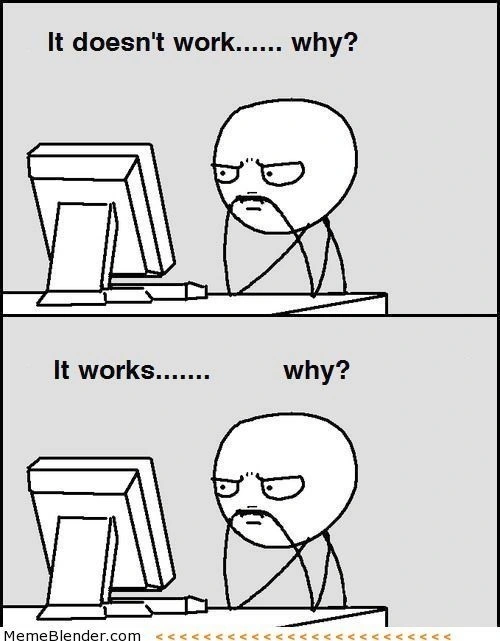

# Programming

**Languages: Artificial and Natural**  

This week we study artificial (programming) languages and compare them to natural languages (for us, English). Borrowing from cognitive science and the philosophy of language, we'll see important ways language and thought influence and shape each other. In earlier weeks we've considered the ways our access to and interpretation of information/data can affect how we describe a problem and how we solve it. This week we'll see how artificial and natural languages can constrain how we describe and even think about reality.

We'll also compare different theories of how natural languages work. Theories of language, like theories of consciousness and  information processing, have implications for whether AI can fully understand and employ human language. Monday we'll explore the parallels between natural language (English) and artificial language (Python) in terms of grammar rule, parsing and interpretation (how natural languages are 'fuzzy'). This also helps guide researchers along the most promising paths. On Wednesday you'll learn four major programming paradigms to discover how each "thinks" and "describes" a problem differently. Then we'll explore more deeply object-oriented programming (OOP) and its philosophical counterpart, object-oriented ontology (OOO).

In Friday's class we'll focus on the big questions: How has Computation/AI changed the way we understand language, how we philosophically conceptualize our world, and how we theorize our cultural productions?

In datacamp, you'll continue with Intermediate Python both this week and next. Many of the units spiral back to concepts already introduced, from Matplotlib to slicing. You will also employ the various kinds of logic and loops we first encountered in pseudocode.

**Monday: Thinking in Artificial and Natural Languages (some aspects of thought are independent of language)**

- [How to think like a Programmer](https://www.youtube.com/watch?v=azcrPFhaY9k) (ONLY up to 41:00) CodingTech, Oct 2018
- [Linguistics as a Window to Understand the Brain](https://www.youtube.com/watch?v=Q-B_ONJIEcE&feature=youtu.be) (ONLY up to 13:39, Words) Steven Pinker, Think Big, Oct 2012
- [Noam Chomsky on Language Acquisition](https://www.youtube.com/watch?v=7Cgpfw4z8cw) (1:47) BBC4, Jan 2015
- [What is the Python Interpreter? (How Does Python Work?)](https://www.youtube.com/watch?v=BkHdmAhapws) (14:00) Afternerd, Aug 2020
- Datacamp Intermediate Python, Unit 1 of 5 (i.e. about 3/4 hour) Matplotlib
- Test Your Understanding
  - The first three videos distinguish between thinking and the translation of the thought process into language, whether artificial or natural. How is this thought process the same or different for natural and artificial languages? Pinker also notes the Sapir-Whorf hypothesis and linguistic relativity, which you should be familiar with.
  - The programming language you are learning, Python, needs to be interpreted for the computer. On the most basic level, how does this work?
  - Datacamp: This unit reviews concepts already learned in earlier datacamps and offers a deeper dive into the visualization and interpretation of data. 

**Wednesday: Programming Paradigms/ Differences in Languages (languages and programming paradigms also shape the way we think)**

- [Pong and Object-Oriented Programming](https://www.youtube.com/watch?v=KyTUN6_Z9TM) (12:30) Computerphile, Mar 2016
- [Four Programming Paradigms in 40 Minutes](https://www.youtube.com/watch?v=cgVVZMfLjEI) (41:00) Coding Tech, Mar 2018 (RF = Thursday/Friday)
- [CARTA: Building Complex Knowledge with Language and Imagination](https://www.youtube.com/watch?v=71Hakkxnu-s) (20:00) Lera Boroditsky, CARTA, Jul 2018
- Datacamp Intermediate Python, Unit 2 of 5, Dictionaries and Pandas
- Test Your Understanding
  - What is Object-Oriented Programming (OOP), and what problems does it solve?
  - If you are new to programming just try to follow along and understand the basic 4 categories of programming languages. We'll discuss more in class.
  - How do languages shape the way we think and even what we can imagine?
  - What functionality do dictionaries offer over lists? Also a new way to select data from a DataFrame: iloc and loc; we'll practice in class!

**Friday: How does AI/Computation Challenge our Theories of Language, of Philosophical Positions, and of Cultural Production?**

- The first two readings (Pinker and SlateStarCodex) are simply to give you contrasting views of language as either complex psycho-social phenomena or simply large-scale statistical correlations. This is a debate similar to that over language acquisition between B.F. Skinner's [Behavioral Theory](https://www.simplypsychology.org/language.html#:~:text=Skinner%20argued%20that%20children%20learn,value%20of%20words%20and%20phrases.) and Chomsky's Universal Grammar (introduced on Monday).
- [Linguistics as a Window to Understand the Brain](https://www.youtube.com/watch?v=Q-B_ONJIEcE&feature=youtu.be) (CONTINUE 13:30-32:00 through CRITIQUES OF CHOMSKY) Steven Pinker, Think Big, Oct 2012
- [GPT-2 as a Step Towards General Intelligence](https://slatestarcodex.com/2019/02/19/gpt-2-as-step-toward-general-intelligence/), Slate Star Codex, Feb 2019 (GPT-2 is an earlier and much smaller/less powerful model of the GPT-3 we introduced the first day of class).
- [Knuth: Computer Programming as an Art](http://www.paulgraham.com/knuth.html), Donald Knuth (reposted by Paul Graham), CACM Dec 1974 (Background for the following questions: Is writing in code an art, just like writing in a natural language? Have great cultural products been written in code?)
- [What is Object-Oriented Ontology? A Quick and Dirty Guide to the Philosophical Movement Sweeping the Art World](https://www.artspace.com/magazine/interviews_features/the_big_idea/a-guide-to-object-oriented-ontology-art-53690), Dylan Kerr, Apr 2016
- Datacamp Intermediate Python Unit 3 of 5 Logic, Control Flow and Filtering
- Test Your Understanding
  - Theories of language are important for understanding how computers can both "understand" and generate language. What are the critiques of Chomsky? What do you think of GPT-2 and its output? Does it tell us anything about how language works?
  - Is writing in code an art (Knuth), and should we consider recent creations in code (Github, etc) as cultural artifacts worthy of study just like other cultural production (visual arts, literature, etc)?
  - Can you explain OOO? How does this philosophical position reflect the "thought" of objected-oriented programming? Is it ethically compelling or not, and why?
  - Datacamp: Be familiar with the syntax for conditionals and logical expressions in Python.

**In Class Demos**:

- The professor said on Monday he would give an exam.
- The chicken is ready to eat.
- The burglar threatened the student with the knife.
- Visiting relatives can be boring.
- Time flies like an arrow. (at least 4)
- SpaCy [Dependency Parser](https://explosion.ai/demos/displacy) Visualizer (Syntactic Ambiguity [Examples](https://www.thoughtco.com/syntactic-ambiguity-grammar-1692179))
- [Grammar Generation](https://www.nltk.org/book/ch08.html) and [Python 3.7 Specification](https://docs.python.org/3.7/reference/grammar.html)
- Python [Grammar and AST](https://colab.research.google.com/drive/17wTMyW8b75dlK_lTM1UFGumjvMZAMO9f?usp=sharing) ([Explanation](https://www.codeproject.com/Articles/5310967/Analyzing-Python-with-the-AST-Package))
- Visualize Code with [PythonTutor](https://pythontutor.com/)
- Compare [3 Paradigms](https://www.geeksforgeeks.org/programming-paradigms-in-python/) in Python ([Multi-Paradigm Python)](https://colab.research.google.com/drive/15yKEsHpgKmRpxQYQck3G5VGtMnu7fdPx?usp=sharing)
- Dictionaries and DataFrame selection (loc/iloc)
- Conditionals (if/elif/else) and composing logical predicates (and/or/not)
